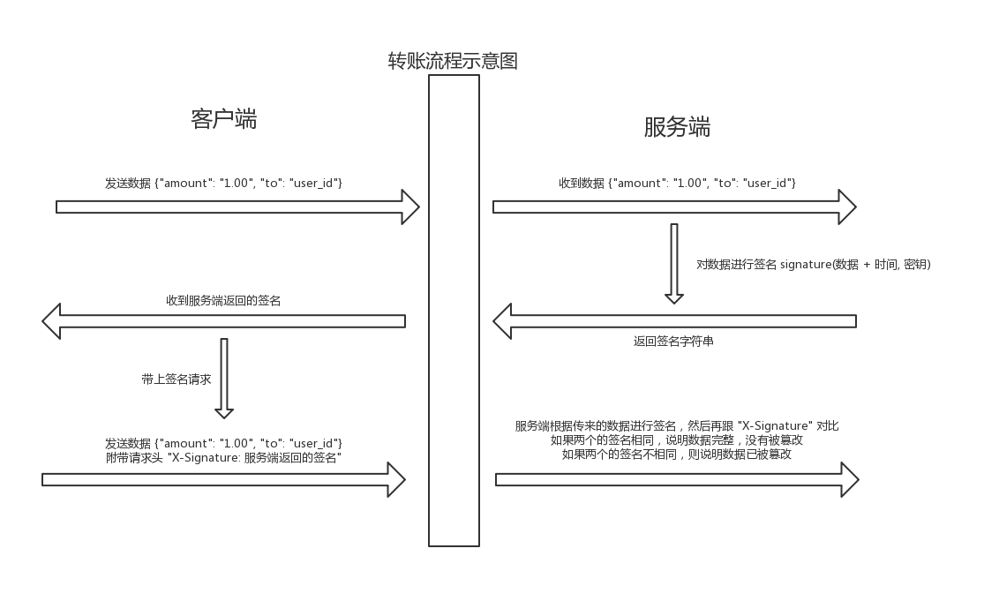

## 一个数据签名的例子

在一些接口中，需要传输一些敏感数据。这里以 `金额转账` 为例, 它有可能会被攻击者篡改, 如篡改`转账金额`/`转账对象`。

那么如何预防?

1. 上 HTTPS
2. 对数据签名

这里就说一下对数据签名的实现原理, 这里就可以做一个简单实现.

延伸一下，甚至可以参考 `JWT` 实现一个比较复杂的实现，例如`签名过期`，`签发者`, `自定义算法`等等

之前写过一篇 [JWT 的原理](https://github.com/axetroy/blog/issues/177), 可以产考一下.

### 工作原理

[](workflow.jpg)

### 数据签名

```bash
curl -H "Content-Type:application/json" -X POST -d '{"amount": "1.00", "to":"user_id"}' https://signature-example.herokuapp.com/signature
```

### 携带数据签名请求

```bash
curl -H "X-Signature:Zjk4YTE5OTQ4MjZiNDM5MzYwOTE1NzdjYjQ2NmMyMmZmMTNjZmIzNDg1MjIxMTM0ZGVlZDI3ZGMzMGFjZmFlMw==" -H "Content-Type:application/json" -X POST -d '{"amount": "1.00", "to":"user_id"}' https://signature-example.herokuapp.com/signature
```
